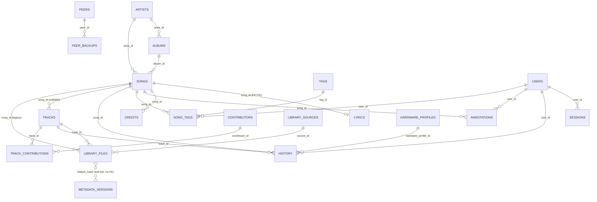

# Phonolith Database Schema

> Generated from a full read of every file in `src/migrations/*.sql` (21 files, `001_initial.sql`
> through `021_library_files_track_number.sql`), plus supporting reads of `src/lib/db.ts`,
> `src/instrumentation.ts`, `src/lib/crypto.ts`, `src/app/api/library/ingest/route.ts`, and
> `analyst/scanner.py` to explain runtime behaviors (encryption, hash re-keying) that the SQL alone
> doesn't make obvious. This document describes the database's **current, cumulative** shape — i.e.
> what a table looks like after every migration that touches it has been applied in order, not just
> what any single migration file contains.

## Overview

Phonolith runs on **Postgres 16**. There is no separate migration CLI or manual step — migrations
are applied automatically on application boot. `src/instrumentation.ts` implements Next.js's
`register()` hook, which runs once when the Node.js server process starts and calls
`runMigrations()` from `src/lib/db.ts`. That function:

1. Ensures a `schema_migrations` bookkeeping table exists (`filename TEXT PRIMARY KEY, applied_at TIMESTAMPTZ DEFAULT NOW()`).
2. Reads every `*.sql` file in `src/migrations/`, sorted lexically (which is why files are
   zero-padded, e.g. `001_`, `002_`, ... `021_` — plain alphabetic sort must equal numeric order).
3. Skips any filename already present in `schema_migrations`.
4. For each new file, runs the entire file's SQL as one unsafe/raw statement batch
   (`sql.unsafe(sqlContent)`), records the filename into `schema_migrations`, and logs
   `` `[db] applied migration: ${file}` `` to stdout — this is the log line to grep for in container
   logs when diagnosing "did my migration run?" questions.

Because there is no rollback mechanism and migrations are just forward-only SQL files replayed with
`IF NOT EXISTS` / `ADD COLUMN IF NOT EXISTS` guards, the migrations are effectively idempotent and
safe to re-run against a partially-migrated database — this is also why almost every `CREATE TABLE`
and `ALTER TABLE ... ADD COLUMN` in the codebase is guarded with `IF NOT EXISTS`.

The schema backs a self-hosted music library manager with several "branded" internal subsystems
(Engram, Cathode, Polyphony, Soulcatcher, Lexicon, etc. — see `src/app/docs/page.tsx` for the
in-app architecture glossary). Each subsystem's tables are called out explicitly below.

---

## Migration History

| # | File | Summary |
|---|------|---------|
| 001 | `001_initial.sql` | Creates the Genius-sourced metadata core: `artists`, `albums`, `songs`, `lyrics`. |
| 002 | `002_credits_annotations.sql` | Adds `credits` (song personnel) and `annotations` (Genius-style lyric annotations). |
| 003 | `003_library.sql` | Adds `library_files` — the physical audio file table, keyed by `blake3_hash`, initially linked straight to `songs`. |
| 004 | `004_tags.sql` | Adds `tags` and the `song_tags` many-to-many join table. |
| 005 | `005_history.sql` | Adds `history` (play/scrobble event log) with indexes on `created_at`, `artist_id`, `song_id`. |
| 006 | `006_library_sources.sql` | Adds `library_sources` — configured storage backends (local/SMB/NFS/iSCSI) with a JSONB `config` blob. |
| 007 | `007_settings.sql` | Adds `app_settings`, a generic key/value store for application configuration. |
| 008 | `008_engram.sql` | Adds `metadata_versions` — the **Engram** subsystem's append-only metadata snapshot history, keyed by `blake3_hash`. |
| 009 | `009_library_ext.sql` | Extends `library_files` with AccurateRip verification fields (`accuraterip_status`, `accuraterip_confidence`) and `mb_release_group_id`. |
| 010 | `010_cathode.sql` | Adds `hardware_profiles` (the **Cathode** subsystem: DAC/amp/speaker/headphone rigs and their accumulated playback hours) and links `history` to it via `hardware_profile_id`. |
| 011 | `011_users.sql` | Adds `users` (local auth) and retrofits `user_id` onto `history`, `annotations`, and `song_tags`, backfilling existing rows to user id `1`. |
| 012 | `012_tracks.sql` | Adds the logical `tracks` entity (MusicBrainz/AcoustID-matched, independent of any physical file), `contributors`, and the `track_contributions` role join table; adds `track_id` to `history`. |
| 013 | `013_restructure.sql` | Major `library_files` restructuring: adds `track_id`, `source_id`, `relative_path`, `disc_number`, denormalized tag fields (`title`/`artist`/`album`/`year`), fast-identity-check fields (`inode`, `file_size`, `mtime`), and `cover_art_path`. Deprecates (but does not drop) the old `file_path`/`song_id` columns. |
| 014 | `014_source_markers.sql` | Adds offline/online tracking: `library_sources.status`/`root_marker_uuid`/`last_seen_at`/`offline_since`, and `library_files.source_online`. |
| 015 | `015_library_ext2.sql` | Adds Plex-style metadata locking (`library_files.metadata_locked`, `metadata_overrides`), `songs.disc_number`, and `pg_trgm` fuzzy-search GIN indexes on `library_files` title/artist/album. |
| 016 | `016_lyrics_synced.sql` | Adds `lyrics.synced_lyrics` for LRCLIB-sourced time-synced (LRC) lyrics. |
| 017 | `017_sessions.sql` | Adds `sessions` — server-side auth session store referencing `users`. |
| 018 | `018_engineer_tag.sql` | Adds `library_files.engineer` (mastering/mixing/recording engineer credit read from file tags). |
| 019 | `019_polyphony.sql` | Adds the **Polyphony** peer-to-peer subsystem: `peers`, `peer_pairing_codes`, `peer_backups`. |
| 020 | `020_soulcatcher.sql` | Adds `soulcatcher_downloads` — the **Soulcatcher** subsystem's durable Soulseek (slskd) download history. |
| 021 | `021_library_files_track_number.sql` | Adds `library_files.track_number` — a hotfix; the column was missing while the ingest route already referenced it, so every ingest insert was failing and the library appeared empty. |

Total: **21 migration files**, producing **23 application tables** plus the migration runner's own
`schema_migrations` bookkeeping table (24 tables total).

---

## Table Reference

### `artists`
*(from `001_initial.sql`)*

**Purpose:** A musical artist/performer, sourced primarily from the Genius API (with an optional
MusicBrainz cross-reference). This is metadata-layer data, not a physical-file concept.

| Column | Type | Constraints | Meaning |
|---|---|---|---|
| `id` | `SERIAL` | `PRIMARY KEY` | Internal numeric id. |
| `genius_id` | `INTEGER` | `UNIQUE` | Genius API artist id; unique when present, nullable (non-Genius artists). |
| `mb_id` | `UUID` | — | MusicBrainz Artist MBID, if resolved. |
| `name` | `TEXT` | `NOT NULL` | Display name. |
| `image_url` | `TEXT` | — | Artist image, from Genius. |
| `description` | `TEXT` | — | Bio/description text (Genius). |
| `followers` | `INTEGER` | — | Follower count snapshot (Genius). |
| `fetched_at` | `TIMESTAMPTZ` | — | When this record was last fetched/refreshed from Genius. |

**Primary key:** `id`. **Foreign keys:** none (root entity). **Indexes:** none beyond the PK and
the implicit unique index on `genius_id`.

---

### `albums`
*(from `001_initial.sql`)*

**Purpose:** An album/release, Genius-sourced, optionally cross-referenced to MusicBrainz.

| Column | Type | Constraints | Meaning |
|---|---|---|---|
| `id` | `SERIAL` | `PRIMARY KEY` | Internal id. |
| `genius_id` | `INTEGER` | `UNIQUE` | Genius API album id. |
| `mb_id` | `UUID` | — | MusicBrainz Release/Release-Group MBID. |
| `artist_id` | `INTEGER` | `REFERENCES artists(id)` | Owning artist. No `ON DELETE` clause specified → defaults to `NO ACTION` (deleting a referenced artist is blocked unless the FK is dropped/altered). |
| `name` | `TEXT` | `NOT NULL` | Album title. |
| `cover_art_url` | `TEXT` | — | Cover art image URL. |
| `release_date` | `DATE` | — | Release date. |
| `fetched_at` | `TIMESTAMPTZ` | — | Last Genius fetch time. |

**Primary key:** `id`. **Foreign keys:** `artist_id → artists(id)` (implicit `NO ACTION`).
**Indexes:** PK + unique index on `genius_id`.

---

### `songs`
*(from `001_initial.sql`, extended by `015_library_ext2.sql`)*

**Purpose:** A "song" as a Genius/lyrics-metadata concept — title, description, lyrics linkage,
credits, annotations. This is distinct from `tracks` (added later in `012_tracks.sql`), which
represents the *library/playback* notion of a recording. `songs` is the legacy/metadata-scraping
entity that `tracks.song_id` optionally links out to.

| Column | Type | Constraints | Meaning |
|---|---|---|---|
| `id` | `SERIAL` | `PRIMARY KEY` | Internal id. |
| `genius_id` | `INTEGER` | `UNIQUE` | Genius API song id. |
| `mb_id` | `UUID` | — | MusicBrainz Recording MBID (secondary/legacy — `tracks.mb_recording_id` is the authoritative one now). |
| `artist_id` | `INTEGER` | `REFERENCES artists(id)` | Primary artist. |
| `album_id` | `INTEGER` | `REFERENCES albums(id)` | Parent album. |
| `title` | `TEXT` | `NOT NULL` | Song title. |
| `full_title` | `TEXT` | — | Genius's "full title" (e.g. "Song Name by Artist"). |
| `path` | `TEXT` | — | Genius URL path/slug. |
| `release_date` | `DATE` | — | Release date. |
| `song_art_image_url` | `TEXT` | — | Cover/song art image. |
| `description` | `TEXT` | — | Genius description/annotation body. |
| `pageviews` | `INTEGER` | — | Genius pageview count snapshot. |
| `fetched_at` | `TIMESTAMPTZ` | — | Last fetch time. |
| `disc_number` | `INT` | `NOT NULL DEFAULT 1` | *(added in 015)* Disc number, for multi-disc album queries — added so `songs` could support the same disc-aware queries as `library_files`/`tracks`. |

**Primary key:** `id`. **Foreign keys:** `artist_id → artists(id)`, `album_id → albums(id)` (both
implicit `NO ACTION`). **Indexes:** PK + unique index on `genius_id`.

---

### `lyrics`
*(from `001_initial.sql`, extended by `016_lyrics_synced.sql`)*

**Purpose:** Lyrics content for a song — both plain text (scraped from Genius) and time-synced
LRC-format lyrics (from LRCLIB), so the frontend can offer a karaoke-style synced view when
available.

| Column | Type | Constraints | Meaning |
|---|---|---|---|
| `song_id` | `INTEGER` | `PRIMARY KEY`, `REFERENCES songs(id)` | One-to-one with `songs`; the song's id doubles as this table's PK. |
| `content` | `TEXT` | — | Plain-text lyrics (Genius). |
| `scraped_at` | `TIMESTAMPTZ` | — | When plain-text lyrics were scraped. |
| `synced_lyrics` | `TEXT` | — | *(added in 016)* LRC-format (time-tagged, `[mm:ss.xx]`) lyrics from LRCLIB, kept alongside `content` so both plain and synced rendering are possible. |

**Primary key:** `song_id` (also the FK — true 1:1 relationship, not a separate surrogate key).
**Foreign keys:** `song_id → songs(id)`. **Indexes:** none beyond the PK.

---

### `credits`
*(from `002_credits_annotations.sql`)*

**Purpose:** Named-role credits for a song (writer, producer, etc.), Genius-sourced.

| Column | Type | Constraints | Meaning |
|---|---|---|---|
| `id` | `SERIAL` | `PRIMARY KEY` | Internal id. |
| `song_id` | `INTEGER` | `REFERENCES songs(id)` | Song this credit belongs to. |
| `role` | `TEXT` | — | Credit role (e.g. "Producer", "Writer"). |
| `name` | `TEXT` | — | Person/entity name. |
| `genius_id` | `INTEGER` | — | Genius id for this contributor, if known (no `UNIQUE` — a person can have multiple credit rows across songs/roles). |

**Primary key:** `id`. **Foreign keys:** `song_id → songs(id)` (implicit `NO ACTION`).
**Indexes:** none beyond PK. Note: this is the Genius-metadata analogue of the later, more
structured `contributors`/`track_contributions` tables added in `012_tracks.sql` for the
library/track domain — the two systems are not merged.

---

### `annotations`
*(from `002_credits_annotations.sql`, extended by `011_users.sql`)*

**Purpose:** Genius-style crowd-sourced lyric annotations (explanations of a lyric fragment),
plus (since migration 011) which local user created/owns each one.

| Column | Type | Constraints | Meaning |
|---|---|---|---|
| `id` | `SERIAL` | `PRIMARY KEY` | Internal id. |
| `song_id` | `INTEGER` | `REFERENCES songs(id)` | Song being annotated. |
| `fragment` | `TEXT` | — | The specific lyric fragment/snippet being annotated. |
| `body` | `TEXT` | — | The annotation's explanatory text. |
| `source` | `TEXT` | `DEFAULT 'genius'` | Where the annotation came from (only `'genius'` seen as a default; presumably could be `'user'` for local annotations). |
| `created_at` | `TIMESTAMPTZ` | `DEFAULT NOW()` | Creation timestamp. |
| `user_id` | `INT` | `REFERENCES users(id) ON DELETE CASCADE` | *(added in 011)* Owning local user. Backfilled to `1` for all pre-existing rows since Phonolith was single-user before this migration. |

**Primary key:** `id`. **Foreign keys:** `song_id → songs(id)` (`NO ACTION`), `user_id →
users(id)` (`ON DELETE CASCADE` — deleting a user deletes their annotations). **Indexes:** PK +
`idx_annotations_user_id` on `user_id`.

---

### `library_files`
*(from `003_library.sql`; extended by `009_library_ext.sql`, `013_restructure.sql`,
`014_source_markers.sql`, `015_library_ext2.sql`, `018_engineer_tag.sql`,
`021_library_files_track_number.sql` — the most heavily-modified table in the schema)*

**Purpose:** One row per physical audio file discovered on disk (local, SMB, NFS, or iSCSI
source). This is the core of the library scanner ("analyst" sidecar) and is keyed by
**content-addressed BLAKE3 hash**, not by path — see the **Known Gotchas** section below for the
important two-phase hashing/re-keying behavior this implies.

| Column | Type | Constraints | Meaning |
|---|---|---|---|
| `id` | `SERIAL` | `PRIMARY KEY` | Internal id. |
| `blake3_hash` | `TEXT` | `UNIQUE NOT NULL` | **Content-addressed identity of the file.** The canonical dedup/upsert key (see Gotchas — this value can be rewritten in place as the scan pipeline progresses). |
| `file_path` | `TEXT` | `NOT NULL` | Original absolute file path. **Deprecated** as of migration 013 in favor of `source_id` + `relative_path`, but the column is kept (never dropped) "to avoid breaking existing queries during transition." Still populated on every ingest. |
| `song_id` | `INTEGER` | `REFERENCES songs(id)` | Original (migration-003-era) direct link to a Genius `songs` row. Superseded by the `tracks`/`track_id` model introduced in 012/013; still present in the schema (never dropped) but effectively vestigial — no code path was found still writing to it in the current ingest route. |
| `format` | `TEXT` | — | File extension/codec, e.g. `flac`, `mp3`. |
| `bitrate` | `INTEGER` | — | Audio bitrate. |
| `sample_rate` | `INTEGER` | — | Sample rate (Hz). |
| `bit_depth` | `INTEGER` | — | Bit depth. |
| `duration_ms` | `INTEGER` | — | Duration in milliseconds. |
| `dr_score` | `REAL` | — | Computed Dynamic Range / Crest Factor score ("Crest" subsystem). |
| `spectral_ok` | `BOOLEAN` | — | Result of upscale / fake-lossless spectral analysis ("Prism" subsystem) — `true` means the file's spectral content appears genuine for its stated format/bitrate. |
| `waveform_path` | `TEXT` | — | Path to a rendered waveform PNG, sharded by hash (see Naming & Conventions). |
| `fingerprint` | `TEXT` | — | AcoustID audio fingerprint. |
| `indexed_at` | `TIMESTAMPTZ` | `DEFAULT NOW()` | Last time this row was (re-)indexed/upserted. |
| `accuraterip_status` | `TEXT` | — | *(009)* AccurateRip disc-rip verification result: `'verified'` \| `'not_found'` \| `'mismatch'` \| `null`. |
| `accuraterip_confidence` | `INT` | — | *(009)* AccurateRip confidence count (how many other rippers' checksums agree). |
| `mb_release_group_id` | `TEXT` | — | *(009)* MusicBrainz Release Group MBID this file's release matches. |
| `track_id` | `UUID` | `REFERENCES tracks(id) ON DELETE SET NULL` | *(013)* Link to the logical `tracks` row this physical file represents. This is the **current** canonical way files relate to logical recordings (history/tags/playlists attach to `tracks`, not to `library_files` directly). |
| `source_id` | `INT` | `REFERENCES library_sources(id) ON DELETE SET NULL` | *(013)* Which configured storage source this file lives on. |
| `relative_path` | `TEXT` | — | *(013)* Path **relative to the source root** — the canonical location field going forward, replacing `file_path`. |
| `disc_number` | `INT` | `NOT NULL DEFAULT 1` | *(013)* Disc number from embedded tags. |
| `title` | `TEXT` | — | *(013)* Embedded tag title, denormalized onto the file row for query speed. |
| `artist` | `TEXT` | — | *(013)* Embedded tag artist. |
| `album` | `TEXT` | — | *(013)* Embedded tag album. |
| `year` | `TEXT` | — | *(013)* Embedded tag year. |
| `inode` | `BIGINT` | — | *(013)* Filesystem inode number — used as part of a fast-path "did this file change?" identity check without re-hashing. |
| `file_size` | `BIGINT` | — | *(013)* File size in bytes (also part of the fast-path identity check, and part of the "turbo pass" provisional hash input — see Gotchas). |
| `mtime` | `BIGINT` | — | *(013)* Unix timestamp (seconds) of last modification — third leg of the fast-path identity check. |
| `cover_art_path` | `TEXT` | — | *(013)* Sharded cover art path, e.g. `waveforms/a1/b2/hash_cover.jpg`. |
| `source_online` | `BOOLEAN` | `NOT NULL DEFAULT TRUE` | *(014)* Whether this file's source is currently reachable. When a source goes offline, its files are **preserved** in the DB (not deleted) and flagged via this column rather than being purged, so a temporarily-disconnected NAS doesn't wipe out library history. |
| `metadata_locked` | `BOOLEAN` | `NOT NULL DEFAULT FALSE` | *(015)* Plex-style lock: when `true`, prevents automatic re-matching/rescraping from overwriting a manually-edited value. |
| `metadata_overrides` | `JSONB` | — | *(015)* Field-level user overrides, merged with scraped/tag data at query time (comment: "merged at query time" — i.e. this is not pre-flattened into the row's own columns). |
| `engineer` | `TEXT` | — | *(018)* Mastering/mixing/recording engineer credit, read by Lexicon from ID3 `TXXX:ENGINEER` / `TIPL` / `TMCL` frames or the FLAC/Vorbis `engineer` comment. |
| `track_number` | `INT` | — | *(021)* Track number within the disc. Added as a **hotfix**: the ingest route referenced this column before it existed, so every insert failed with "column does not exist" and the library appeared completely empty until this migration landed. |

**Primary key:** `id`. **Unique constraint:** `blake3_hash`.

**Foreign keys:**
- `song_id → songs(id)` — no `ON DELETE` specified (`NO ACTION`); legacy/likely-dead column.
- `track_id → tracks(id) ON DELETE SET NULL`
- `source_id → library_sources(id) ON DELETE SET NULL`

**Indexes:**
- PK (`id`), unique index on `blake3_hash`
- `idx_library_files_track_id` on `track_id`
- `idx_library_files_source_id` on `source_id`
- `idx_library_files_rel_path` on `(source_id, relative_path)`
- `idx_library_files_inode` on `(source_id, inode, file_size, mtime)` — the fast-path "unchanged file" lookup
- `idx_library_files_source_online` on `source_online` **partial index** `WHERE NOT source_online` — cheap lookup of just the currently-offline files
- `idx_library_files_title_trgm`, `idx_library_files_artist_trgm`, `idx_library_files_album_trgm` — GIN trigram (`pg_trgm` extension, `gin_trgm_ops`) indexes for fuzzy/typo-tolerant search on `title`/`artist`/`album`
- `idx_library_files_track_number` on `track_number`

---

### `tags`
*(from `004_tags.sql`)*

**Purpose:** User-defined free-form tags (e.g. mood, genre, custom labels) applyable to songs.

| Column | Type | Constraints | Meaning |
|---|---|---|---|
| `id` | `SERIAL` | `PRIMARY KEY` | Internal id. |
| `name` | `TEXT` | `UNIQUE NOT NULL` | Tag label. |
| `color` | `TEXT` | `DEFAULT '#a78bfa'` | Display color (hex), defaults to a light purple. |
| `created_at` | `TIMESTAMPTZ` | `DEFAULT NOW()` | Creation time. |

**Primary key:** `id`. **Indexes:** PK + unique index on `name`.

---

### `song_tags`
*(from `004_tags.sql`, extended by `011_users.sql`)*

**Purpose:** Many-to-many join between `songs` and `tags`, scoped per user since migration 011.

| Column | Type | Constraints | Meaning |
|---|---|---|---|
| `song_id` | `INTEGER` | part of composite `PRIMARY KEY`, `REFERENCES songs(id)` | Tagged song. |
| `tag_id` | `INTEGER` | part of composite `PRIMARY KEY`, `REFERENCES tags(id)` | Applied tag. |
| `user_id` | `INT` | `REFERENCES users(id) ON DELETE CASCADE` | *(added in 011)* Which user applied this tag. **Note:** the original composite PK `(song_id, tag_id)` was **not** widened to include `user_id` — see Gotchas, this means two different users still cannot independently tag the same song with the same tag (the PK would collide). |

**Primary key:** `(song_id, tag_id)` (unchanged since 004). **Foreign keys:** `song_id →
songs(id)`, `tag_id → tags(id)` (both `NO ACTION`), `user_id → users(id) ON DELETE CASCADE`.
**Indexes:** PK + `idx_song_tags_user_id` on `user_id`.

---

### `history`
*(from `005_history.sql`; extended by `010_cathode.sql`, `011_users.sql`, `012_tracks.sql`)*

**Purpose:** Event log for playback/scrobble-style events (the "EchoGraph" analytics subsystem
reads this). Rows can reference a Genius `song`, an `artist`, a logical `track`, the local
`user`, and/or the `hardware_profile` used for playback.

| Column | Type | Constraints | Meaning |
|---|---|---|---|
| `id` | `SERIAL` | `PRIMARY KEY` | Internal id. |
| `song_id` | `INTEGER` | `REFERENCES songs(id)` | Genius-sourced event subject (legacy path). |
| `artist_id` | `INTEGER` | `REFERENCES artists(id)` | Event's artist. |
| `event` | `TEXT` | — | Event type/label (e.g. a "played" event; no CHECK constraint restricts values). |
| `created_at` | `TIMESTAMPTZ` | `DEFAULT NOW()` | Event timestamp. |
| `hardware_profile_id` | `INT` | `REFERENCES hardware_profiles(id) ON DELETE SET NULL` | *(010)* Which playback hardware rig was in use — Cathode subsystem. |
| `user_id` | `INT` | `REFERENCES users(id) ON DELETE CASCADE` | *(011)* Which local user generated the event. Backfilled to `1` for existing rows. |
| `track_id` | `UUID` | `REFERENCES tracks(id) ON DELETE SET NULL` | *(012)* Logical-track subject for library play events (the comment in 012 clarifies: "songs remain for Genius-sourced events; tracks for library play events" — i.e. `song_id` and `track_id` are two parallel, not-mutually-exclusive ways history rows can be attributed, depending on the origin of the event). |

**Primary key:** `id`. **Foreign keys:** `song_id → songs(id)` (`NO ACTION`), `artist_id →
artists(id)` (`NO ACTION`), `hardware_profile_id → hardware_profiles(id) ON DELETE SET NULL`,
`user_id → users(id) ON DELETE CASCADE`, `track_id → tracks(id) ON DELETE SET NULL`.

**Indexes:** `idx_history_created_at` on `created_at DESC`, `idx_history_artist_id` on
`artist_id`, `idx_history_song_id` on `song_id`, `idx_history_hardware` on `hardware_profile_id`,
`idx_history_user_id` on `user_id`, `idx_history_track_id` on `track_id`.

---

### `library_sources`
*(from `006_library_sources.sql`, extended by `014_source_markers.sql`)*

**Purpose:** A configured storage backend the scanner walks for audio files — local disk, SMB
share, NFS mount, or iSCSI target. Holds connection config (host/credentials/share name) and
online/offline health tracking.

| Column | Type | Constraints | Meaning |
|---|---|---|---|
| `id` | `SERIAL` | `PRIMARY KEY` | Internal id. |
| `name` | `TEXT` | `NOT NULL` | User-facing label for the source. |
| `type` | `TEXT` | `NOT NULL`, `CHECK (type IN ('local','smb','nfs','iscsi'))` | Storage backend kind. |
| `config` | `JSONB` | `NOT NULL DEFAULT '{}'` | Connection details (host, share path, credentials, mount options, etc.). **Important:** despite the `JSONB` type, application code (`src/lib/crypto.ts`) may store this as an **AES-256-GCM encrypted hex string** rather than a plain JSON object — see Known Gotchas / Naming & Conventions below. |
| `enabled` | `BOOLEAN` | `DEFAULT true` | Whether the scanner should scan this source at all. |
| `last_scanned_at` | `TIMESTAMPTZ` | — | Last completed scan time. |
| `created_at` | `TIMESTAMPTZ` | `DEFAULT NOW()` | Creation time. |
| `status` | `TEXT` | `NOT NULL DEFAULT 'ok'` | *(014)* `'ok'` \| `'offline'` \| `'error'`. |
| `root_marker_uuid` | `TEXT` | — | *(014)* A UUID written to a `.phonolith_id` marker file at the source root; before any cleanup pass, the scanner checks this marker is still readable to confirm the mount is genuinely the same filesystem (not just an empty/disconnected mount point masquerading as an empty library). |
| `last_seen_at` | `TIMESTAMPTZ` | — | *(014)* Last time the source was confirmed reachable. |
| `offline_since` | `TIMESTAMPTZ` | — | *(014)* When the source was first detected offline (`null` while online). |

**Primary key:** `id`. **Foreign keys:** none (referenced *by* `library_files.source_id`).
**Indexes:** PK only (no explicit secondary indexes defined in migrations).

---

### `app_settings`
*(from `007_settings.sql`)*

**Purpose:** Generic application-wide key/value configuration store (e.g. feature flags, API
keys not tied to a specific source, misc settings surfaced in the Settings UI).

| Column | Type | Constraints | Meaning |
|---|---|---|---|
| `key` | `TEXT` | `PRIMARY KEY` | Setting name. |
| `value` | `TEXT` | `NOT NULL` | Setting value, stored as text (callers are responsible for their own serialization, e.g. JSON-in-a-string, if a value isn't a plain string). |
| `updated_at` | `TIMESTAMPTZ` | `DEFAULT NOW()` | Last write time. |

**Primary key:** `key`. No foreign keys, no secondary indexes.

---

### `metadata_versions` — Engram subsystem
*(from `008_engram.sql`)*

**Purpose:** This is **Engram**, the metadata version-history/audit-trail layer described in the
app's own architecture docs as "the metadata lock engine & version-control guardian." Every time a
file's metadata is (re)ingested, a full snapshot is appended here (append-only — never updated in
place), keyed by the file's `blake3_hash`, so any prior state can be browsed or restored. Because
it's keyed by hash rather than by `library_files.id`, this table's snapshot history for a given
file **survives** even the physical row's id changing (e.g. if the row were deleted and
re-inserted) — as long as the hash used to look it up matches (see Gotchas re: hash re-keying —
this table's rows are **not** automatically re-keyed when `library_files.blake3_hash` changes, see
below).

| Column | Type | Constraints | Meaning |
|---|---|---|---|
| `id` | `SERIAL` | `PRIMARY KEY` | Internal id. |
| `blake3_hash` | `TEXT` | `NOT NULL` | The file this snapshot belongs to. **Not** a foreign key to `library_files.blake3_hash` and **not unique** — many snapshot rows accumulate per hash over time, and there is no DB-level constraint tying it back to an existing `library_files` row (i.e. orphaned snapshots are possible, e.g. after a file is deleted). |
| `snapshot` | `JSONB` | `NOT NULL` | The full metadata state at that point in time (format, tags, scores, etc. — populated by the ingest route from the same fields being written to `library_files`). |
| `source` | `TEXT` | `NOT NULL DEFAULT 'ingest'` | Provenance of this snapshot: `'ingest'` \| `'user'` \| `'lexicon'` \| `'musicbrainz'` (per inline comment). |
| `note` | `TEXT` | — | Optional human-readable note about this version. |
| `created_at` | `TIMESTAMPTZ` | `NOT NULL DEFAULT NOW()` | When the snapshot was taken. |

**Primary key:** `id`. **Foreign keys:** none (soft link via `blake3_hash`).

**Indexes:** `idx_metadata_versions_hash` on `blake3_hash`; `idx_metadata_versions_created` on
`(blake3_hash, created_at DESC)` — the latter directly supports "give me this file's history,
newest first" queries.

**Planned (per in-app docs, not yet in schema):** "Engram v2" would add per-field lock flags
(`locked_fields: string[]`) so confirmed values can't be silently overwritten by a future scrape —
not present in any migration as of `021`.

---

### `hardware_profiles` — Cathode subsystem
*(from `010_cathode.sql`)*

**Purpose:** This is **Cathode**, the "hardware endpoint tracker & burn-in accountant" — it
models a physical playback rig (DAC, amp, headphones, speakers, or a full system chain) so
listening hours can be attributed to specific gear. The in-app docs describe its purpose as
tracking "whether tube or capacitor-coupled endpoints have received appropriate burn-in time,"
i.e. an audiophile-oriented feature for tracking equipment break-in. Per the in-app architecture
page this subsystem's status is listed as **"planned"** even though its table already exists and
is wired into `history` — treat the UI/automation around it as less mature than the schema
suggests.

| Column | Type | Constraints | Meaning |
|---|---|---|---|
| `id` | `SERIAL` | `PRIMARY KEY` | Internal id. |
| `name` | `TEXT` | `NOT NULL` | e.g. `"Main System"`. |
| `description` | `TEXT` | — | e.g. `"Chord Hugo TT2 → Sennheiser HD800S"`. |
| `device_type` | `TEXT` | `NOT NULL DEFAULT 'system'` | `'dac'` \| `'amp'` \| `'speaker'` \| `'headphone'` \| `'dap'` \| `'system'`. |
| `components` | `JSONB` | `NOT NULL DEFAULT '[]'` | Array of component objects, e.g. `[{role: "DAC", model: "Chord Hugo TT2"}, ...]`. |
| `total_hours` | `FLOAT` | `NOT NULL DEFAULT 0` | Accumulated playback hours — presumably incremented as `history` events referencing this profile accrue duration. |
| `lucid_device` | `TEXT` | — | ALSA device name, e.g. `"hw:0,0"` — the identifier the **Lucid** playback sidecar uses to route bit-perfect audio to this specific hardware endpoint. |
| `created_at` | `TIMESTAMPTZ` | `NOT NULL DEFAULT NOW()` | Creation time. |

**Primary key:** `id`. **Foreign keys:** none (referenced *by* `history.hardware_profile_id`).
**Indexes:** PK only in this migration (see `history` for the index on the referencing column).

---

### `users`
*(from `011_users.sql`)*

**Purpose:** Local authentication accounts. Per the inline migration comment, Phonolith ships
as effectively single-admin-user software today, but the table (and `user_id` foreign keys
scattered onto personal-data tables) was deliberately laid in early "so schema never needs
retrofitting" for multi-user support later.

| Column | Type | Constraints | Meaning |
|---|---|---|---|
| `id` | `SERIAL` | `PRIMARY KEY` | Internal id. |
| `username` | `TEXT` | `NOT NULL UNIQUE` | Login username. |
| `password_hash` | `TEXT` | `NOT NULL` | Hashed password (hashing scheme not visible in SQL — implemented at the application layer, see `src/lib/auth.ts`). |
| `role` | `TEXT` | `NOT NULL DEFAULT 'admin'` | `'admin'` \| `'viewer'`. |
| `created_at` | `TIMESTAMPTZ` | `NOT NULL DEFAULT NOW()` | Account creation time. |

**Primary key:** `id`. **Foreign keys:** none (root entity; referenced by `history.user_id`,
`annotations.user_id`, `song_tags.user_id`, and `sessions.user_id`). **Indexes:** PK + unique
index on `username`.

**Gotcha carried over from the migration comment:** the app currently **hardcodes user id `1`**
in places pending a real multi-user UI — every pre-existing personal-data row was backfilled to
`user_id = 1` and new rows likely default to the same until multi-user support ships.

---

### `tracks`
*(from `012_tracks.sql`)*

**Purpose:** The **logical track entity** — deliberately independent of any physical file. Per
the migration's own header comment: "A track is matched by MusicBrainz Recording MBID or AcoustID
fingerprint. Multiple files (MP3, FLAC, different pressings) may point to the same track. History,
tags, and playlists attach here, never to the physical file." This is the intended long-term
anchor point for all "what did the user listen to / tag / favorite" relationships, superseding the
older direct `songs`/`library_files` linkage.

| Column | Type | Constraints | Meaning |
|---|---|---|---|
| `id` | `UUID` | `PRIMARY KEY DEFAULT gen_random_uuid()` | Surrogate key — note this table uses a **UUID** PK, unlike almost every other table in the schema which uses `SERIAL` integers. (Requires the `pgcrypto`/`pg_catalog` `gen_random_uuid()` function — available by default in Postgres 13+.) |
| `mb_recording_id` | `TEXT` | `UNIQUE` | MusicBrainz Recording MBID — the **authoritative** match key per the inline comment. |
| `acoustid` | `TEXT` | — | AcoustID fingerprint — a secondary/fallback match key. |
| `song_id` | `INTEGER` | `REFERENCES songs(id) ON DELETE SET NULL` | Optional link to the Genius-metadata `songs` row for this recording. |
| `title` | `TEXT` | — | Track title. |
| `disc_number` | `INT` | `NOT NULL DEFAULT 1` | Disc number. |
| `track_number` | `INT` | — | Track number within the disc. |
| `duration_ms` | `INT` | — | Duration in milliseconds. |
| `year` | `TEXT` | — | Release year. |
| `album_name` | `TEXT` | — | Embedded-tag album name, used as a **fallback before a MusicBrainz match** is made. |
| `artist_name` | `TEXT` | — | Embedded-tag artist name, same fallback role. |
| `created_at` | `TIMESTAMPTZ` | `NOT NULL DEFAULT NOW()` | Creation time. |

**Primary key:** `id` (UUID). **Foreign keys:** `song_id → songs(id) ON DELETE SET NULL`.
**Indexes:** `idx_tracks_mb_recording` on `mb_recording_id`, `idx_tracks_acoustid` on `acoustid`,
`idx_tracks_song_id` on `song_id`.

---

### `contributors`
*(from `012_tracks.sql`)*

**Purpose:** A person or entity with a named production role on a track (composer, performer,
producer, engineer, etc.). Explicitly distinct from the Genius-sourced `songs`/`credits` tables —
per the inline comment this is a separate, presumably more curated/MusicBrainz-anchored
contributor registry for the track domain.

| Column | Type | Constraints | Meaning |
|---|---|---|---|
| `id` | `SERIAL` | `PRIMARY KEY` | Internal id. |
| `name` | `TEXT` | `NOT NULL UNIQUE` | Contributor's name — globally unique, i.e. this is a deduplicated person/entity registry, not a per-track free-text field. |
| `mb_artist_id` | `TEXT` | — | MusicBrainz Artist MBID. |
| `genius_id` | `INT` | — | Genius artist id, if cross-referenced. |

**Primary key:** `id`. **Foreign keys:** none. **Indexes:** PK + unique index on `name`.

---

### `track_contributions`
*(from `012_tracks.sql`)*

**Purpose:** Role-based many-to-many join between `tracks` and `contributors` — "composer,
performer, conductor, producer, engineer, featured, mixer…" per the inline comment. A single
contributor can hold multiple distinct roles on the same track (each is its own row).

| Column | Type | Constraints | Meaning |
|---|---|---|---|
| `track_id` | `UUID` | part of composite `PRIMARY KEY`, `REFERENCES tracks(id) ON DELETE CASCADE` | The track. |
| `contributor_id` | `INT` | part of composite `PRIMARY KEY`, `REFERENCES contributors(id) ON DELETE CASCADE` | The contributor. |
| `role` | `TEXT` | `NOT NULL`, part of composite `PRIMARY KEY` | The role this contributor held on this track (e.g. `"producer"`). |

**Primary key:** `(track_id, contributor_id, role)` — a composite three-column key, which is why
the same person can appear multiple times against the same track as long as the role differs.

**Foreign keys:** `track_id → tracks(id) ON DELETE CASCADE`, `contributor_id →
contributors(id) ON DELETE CASCADE` — deleting either the track or the contributor cascades to
remove the join rows.

**Indexes:** PK + `idx_track_contributions_contributor` on `contributor_id`,
`idx_track_contributions_track` on `track_id`.

---

### `sessions`
*(from `017_sessions.sql`)*

**Purpose:** Server-side session store for authenticated `users` (cookie-based session token →
row lookup, standard pattern for a self-hosted app without a third-party auth provider).

| Column | Type | Constraints | Meaning |
|---|---|---|---|
| `id` | `TEXT` | `PRIMARY KEY` | Session token/id (opaque string, presumably a random/cryptographically-generated value minted at login — generation logic lives in `src/lib/auth.ts`, not in SQL). |
| `user_id` | `INTEGER` | `NOT NULL`, `REFERENCES users(id) ON DELETE CASCADE` | Owning user. |
| `expires_at` | `TIMESTAMPTZ` | `NOT NULL` | When the session becomes invalid. |
| `created_at` | `TIMESTAMPTZ` | `NOT NULL DEFAULT now()` | Session creation time. |

**Primary key:** `id`. **Foreign keys:** `user_id → users(id) ON DELETE CASCADE`. **Indexes:**
`sessions_user_id_idx` on `user_id`, `sessions_expires_at_idx` on `expires_at` (supports a
periodic "delete expired sessions" sweep).

---

### `peers` — Polyphony subsystem
*(from `019_polyphony.sql`)*

**Purpose:** **Polyphony** is Phonolith's peer-to-peer instance network — this table is the
registry of other trusted Phonolith instances this one has paired with. Per the migration's
header comment, trust is established explicitly via a one-time out-of-band pairing code (never
via automatic discovery of library contents — LAN mDNS discovery only reveals a peer's
name/host). Each capability is independently toggleable per peer and defaults conservatively.

| Column | Type | Constraints | Meaning |
|---|---|---|---|
| `id` | `TEXT` | `PRIMARY KEY` | The peer's own `polyphony_peer_id` (a UUID, stored as text — the peer's self-asserted identity, not something this instance mints). |
| `name` | `TEXT` | `NOT NULL` | Display name for the peer. |
| `host` | `TEXT` | `NOT NULL` | Base URL, e.g. `https://peer.example.com`. Per the in-app docs, Polyphony does no NAT traversal — this must already be reachable (LAN IP, or a public hostname via Tailscale/Cloudflare Tunnel/etc.). |
| `shared_secret` | `TEXT` | `NOT NULL` | Hex HMAC key, minted during pairing, used to sign/verify all subsequent peer requests (`X-Polyphony-Peer-Id` / `X-Polyphony-Signature` headers, verified with a timing-safe comparison per the in-app docs). **This is a live secret stored in plaintext in this column** — see Known Gotchas. |
| `trust_status` | `TEXT` | `NOT NULL DEFAULT 'trusted'` | `'trusted'` \| `'blocked'`. |
| `share_library` | `BOOLEAN` | `NOT NULL DEFAULT TRUE` | Let this peer browse/stream our library. |
| `share_presence` | `BOOLEAN` | `NOT NULL DEFAULT TRUE` | Let this peer see our now-playing status. |
| `share_backup` | `BOOLEAN` | `NOT NULL DEFAULT FALSE` | Accept backup snapshots pushed by this peer. Defaults to **disabled** — per the inline comment, this consumes the remote peer's disk and should be a deliberate opt-in, unlike the other two capabilities. |
| `paired_at` | `TIMESTAMPTZ` | `NOT NULL DEFAULT NOW()` | When pairing completed. |
| `last_seen_at` | `TIMESTAMPTZ` | — | Last successful contact with this peer. |

**Primary key:** `id` (peer-supplied UUID text). **Foreign keys:** none (referenced *by*
`peer_backups.peer_id`). **Indexes:** PK only.

---

### `peer_pairing_codes` — Polyphony subsystem
*(from `019_polyphony.sql`)*

**Purpose:** Short-lived, single-use codes an admin generates to authorize a new peer pairing
handshake (see `peers` description above for the full flow).

| Column | Type | Constraints | Meaning |
|---|---|---|---|
| `code` | `TEXT` | `PRIMARY KEY` | The pairing code itself (shared out-of-band with the pairing peer's admin). |
| `created_at` | `TIMESTAMPTZ` | `NOT NULL DEFAULT NOW()` | When the code was generated. |
| `expires_at` | `TIMESTAMPTZ` | `NOT NULL` | When the code becomes invalid — enforcing the "short-lived" property; note there's no DB-level cleanup job visible in the migrations, so expired rows likely accumulate unless the application prunes them (or checks `expires_at > now()` at use-time, which is the more likely design given "single-use" semantics would also require a consumed/used flag not present here — expired-but-consumed codes are presumably just left in place or deleted by app logic after use). |

**Primary key:** `code`. No foreign keys, no secondary indexes.

---

### `peer_backups` — Polyphony subsystem
*(from `019_polyphony.sql`)*

**Purpose:** Records of backup snapshots this instance has accepted and stored on behalf of a
peer that has `share_backup` enabled (a peer "mirrors" its library backup onto trusted peers'
storage).

| Column | Type | Constraints | Meaning |
|---|---|---|---|
| `id` | `SERIAL` | `PRIMARY KEY` | Internal id. |
| `peer_id` | `TEXT` | `NOT NULL`, `REFERENCES peers(id) ON DELETE CASCADE` | Which peer this backup belongs to. |
| `snapshot_at` | `TIMESTAMPTZ` | `NOT NULL DEFAULT NOW()` | When the snapshot was taken/received. |
| `size_bytes` | `BIGINT` | `NOT NULL` | Snapshot size. |
| `storage_path` | `TEXT` | `NOT NULL` | Where the mirrored snapshot is stored **locally** (on this instance's disk, on behalf of the remote peer). |
| `checksum` | `TEXT` | `NOT NULL` | Integrity checksum of the snapshot. |

**Primary key:** `id`. **Foreign keys:** `peer_id → peers(id) ON DELETE CASCADE` — deleting a
peer (un-pairing) cascades to delete all backup records for it (though presumably not the actual
on-disk snapshot files — that would need to be handled by application cleanup logic, not the DB).
**Indexes:** `idx_peer_backups_peer_id` on `peer_id`.

---

### `soulcatcher_downloads` — Soulcatcher subsystem
*(from `020_soulcatcher.sql`)*

**Purpose:** **Soulcatcher** is the Soulseek search/download feature, backed by the `slskd`
sidecar container. Per the migration's header comment, `slskd` is the source of truth for
*in-flight* transfer state, but doesn't retain history once a transfer is cleared on its side —
this table is Phonolith's own **durable record of every download ever requested**, so the UI can
show full history without needing to keep polling `slskd` and without losing records once `slskd`
forgets them.

| Column | Type | Constraints | Meaning |
|---|---|---|---|
| `id` | `SERIAL` | `PRIMARY KEY` | Internal id. |
| `query` | `TEXT` | `NOT NULL` | The search query that produced this result. |
| `username` | `TEXT` | `NOT NULL` | The Soulseek peer/user offering the file. |
| `filename` | `TEXT` | `NOT NULL` | Remote filename/path as reported by `slskd`. |
| `size_bytes` | `BIGINT` | `NOT NULL` | File size. |
| `status` | `TEXT` | `NOT NULL DEFAULT 'queued'` | `'queued'` \| `'downloading'` \| `'completed'` \| `'failed'`. |
| `local_path` | `TEXT` | — | Set once the downloaded file has been ingested into the library (i.e. once it has become a `library_files` row — there is no FK linking the two, just a path convention). |
| `requested_at` | `TIMESTAMPTZ` | `NOT NULL DEFAULT NOW()` | When the download was requested. |
| `completed_at` | `TIMESTAMPTZ` | — | When it finished (success or failure — no separate failed-at column). |

**Primary key:** `id`. **Foreign keys:** none — this table is intentionally decoupled from
`library_files`/`tracks` (it's a record of a Soulseek transfer, which may or may not ever become
part of the library). **Indexes:** `idx_soulcatcher_downloads_status` on `status`,
`idx_soulcatcher_downloads_requested_at` on `requested_at DESC`.

---

### `schema_migrations`
*(created programmatically by `runMigrations()` in `src/lib/db.ts`, not by a numbered migration
file — this table manages the numbered migration files themselves)*

**Purpose:** Bookkeeping table so the migration runner knows which `.sql` files have already been
applied and skips them on subsequent boots.

| Column | Type | Constraints | Meaning |
|---|---|---|---|
| `filename` | `TEXT` | `PRIMARY KEY` | The migration filename, e.g. `"012_tracks.sql"`. |
| `applied_at` | `TIMESTAMPTZ` | `DEFAULT NOW()` | When it was applied. |

**Primary key:** `filename`. No foreign keys, no secondary indexes. This table is created with a
plain `CREATE TABLE IF NOT EXISTS` at the very start of every `runMigrations()` call, before any
numbered migration file is even read.

---

## Relationships

### Text tree (ownership / lookup direction)

```
users
 ├─< sessions (user_id, ON DELETE CASCADE)
 ├─< history (user_id, ON DELETE CASCADE)
 ├─< annotations (user_id, ON DELETE CASCADE)
 └─< song_tags (user_id, ON DELETE CASCADE)

artists
 ├─< albums (artist_id)
 ├─< songs (artist_id)
 └─< history (artist_id)

albums ─< songs (album_id)

songs
 ├─ lyrics (song_id, 1:1 PK-as-FK)
 ├─< credits (song_id)
 ├─< annotations (song_id)
 ├─< song_tags (song_id) >─ tags
 ├─< history (song_id)
 ├─< tracks (song_id, ON DELETE SET NULL)      -- optional Genius cross-link
 └─< library_files (song_id)                    -- legacy/likely-dead path, see Gotchas

library_sources
 ├─< library_files (source_id, ON DELETE SET NULL)
 └── config JSONB -- possibly AES-256-GCM-encrypted (see Gotchas)

tracks (UUID PK)
 ├─< library_files (track_id, ON DELETE SET NULL)   -- one-to-many: many physical files, one logical track
 ├─< history (track_id, ON DELETE SET NULL)
 └─< track_contributions (track_id, ON DELETE CASCADE) >─ contributors

hardware_profiles ─< history (hardware_profile_id, ON DELETE SET NULL)   -- Cathode

library_files (content-addressed by blake3_hash)
 └── metadata_versions (soft link via blake3_hash, no FK)                -- Engram

peers (TEXT/UUID PK)
 └─< peer_backups (peer_id, ON DELETE CASCADE)                            -- Polyphony
peer_pairing_codes -- standalone, no FK                                   -- Polyphony

soulcatcher_downloads -- standalone, no FK to library_files                -- Soulcatcher

schema_migrations -- standalone bookkeeping, no FK
app_settings -- standalone key/value, no FK
```

### Mermaid ER diagram



Standalone tables with no FK relationships to any other table: `app_settings`,
`peer_pairing_codes`, `soulcatcher_downloads`, `schema_migrations`.

---

## Naming & Conventions

- **Content-addressed identity (`blake3_hash`).** `library_files.blake3_hash` is the BLAKE3 hash
  of a file's bytes and is the table's true unique key — files are looked up, upserted, and
  deduplicated by hash, not by path. `metadata_versions` is also keyed by this same hash so
  metadata history survives path changes. See Known Gotchas for the crucial nuance that this
  value is **mutable** (re-keyed in place during scanning).
- **Sharded file paths.** Generated artifacts (waveform PNGs, cover art) are stored using a
  sharded directory layout keyed by the file's hash, e.g. `waveforms/a1/b2/hash_cover.jpg`
  (per the inline comment in `013_restructure.sql`) — the first few hex characters of the hash
  become nested directory levels, a standard technique to avoid one giant flat directory.
- **JSONB for open-ended/variable-shape data.** Used for `library_sources.config` (per-backend-type
  connection details), `hardware_profiles.components` (component list), `library_files.metadata_overrides`
  (sparse field overrides), and `metadata_versions.snapshot` (full point-in-time metadata dump).
- **Timestamp conventions.** Every timestamp column is `TIMESTAMPTZ` (timezone-aware), never bare
  `TIMESTAMP`. Creation columns are near-universally named `created_at` with `DEFAULT NOW()` (or
  the lowercase `now()` in `017_sessions.sql` — functionally identical, just inconsistent casing).
  "Last activity" columns follow a `*_at` naming pattern throughout: `fetched_at`, `scraped_at`,
  `indexed_at`, `last_scanned_at`, `last_seen_at`, `offline_since`, `paired_at`, `requested_at`,
  `completed_at`, `applied_at`.
- **`SERIAL` integer PKs are the default; `UUID` is the deliberate exception.** Every table uses
  a `SERIAL` (auto-incrementing integer) primary key **except** `tracks`, which uses
  `UUID PRIMARY KEY DEFAULT gen_random_uuid()`. This looks intentional: `tracks` rows are meant to
  be referenced from multiple contexts (potentially including future cross-instance Polyphony
  sharing or the planned "Sonic Codex" portable manifest format), where UUIDs avoid cross-database
  id collisions in a way sequential integers can't.
- **`IF NOT EXISTS` / `ADD COLUMN IF NOT EXISTS` everywhere.** Nearly every `CREATE TABLE`,
  `CREATE INDEX`, and `ALTER TABLE ... ADD COLUMN` statement across all 21 migrations is guarded
  this way, making the migration set safe to replay against a partially-applied database — this
  is a deliberate defensive pattern given the migration runner has no rollback/down-migration
  concept (see Overview).
- **No `DROP TABLE` or `DROP COLUMN` anywhere in the migration history.** The schema only ever
  grows forward; deprecated columns (see `library_files.file_path`, `library_files.song_id`) are
  left in place rather than removed, explicitly to avoid breaking in-flight queries during a
  transition (per the comment in `013_restructure.sql`).
- **Branded subsystem naming.** Internal subsystems are given standalone product-style names
  independent of their literal table names — useful when searching code/docs for a feature:
  - **Engram** → `metadata_versions` (metadata version history/locking)
  - **Cathode** → `hardware_profiles` (playback hardware & burn-in tracking)
  - **Polyphony** → `peers`, `peer_pairing_codes`, `peer_backups` (LAN/instance-to-instance peering)
  - **Soulcatcher** → `soulcatcher_downloads` (Soulseek/slskd download history)
  - **Lexicon** (metadata resolution engine: Genius/MusicBrainz/Discogs/tag-parsing) has no
    dedicated table of its own — it writes into `songs`/`artists`/`albums`/`library_files`/`tracks`/
    `contributors` and creates `metadata_versions` snapshots; it's a process, not a schema.
  - **Prism**/**Crest** (spectral/DR analysis) similarly have no dedicated tables — their outputs
    land directly in `library_files.spectral_ok` and `library_files.dr_score`.

---

## Known Gotchas

1. **`library_files.blake3_hash` is a re-keyed, two-phase identity — not a stable value written
   once at insert time.** The scanner (`analyst/scanner.py`) runs a fast **"turbo" pass** first
   that computes a cheap, *provisional* hash from just the file's header bytes + size (fast
   enough to run over an entire library quickly), and inserts/updates a `library_files` row keyed
   on that provisional hash. Later, an opt-in **"enhanced" pass** computes the true full-content
   BLAKE3 hash of the same file. When the enhanced pass's real hash differs from the turbo pass's
   provisional hash (which it always will, since they're computed differently), the enhanced pass
   reports both values to the ingest API as `blake3_hash` (new/real) and `previous_hash`
   (old/provisional) — see `analyst/scanner.py` `index_file()` docstring: *"the app re-keys the
   existing library row to the real content hash (rather than leaving it on the provisional key or
   inserting a duplicate)."*
   The Next.js ingest route (`src/app/api/library/ingest/route.ts`, lines ~58-70) implements the
   re-key/dedup logic explicitly:
   - If `previous_hash` is present and differs from the new `blake3_hash`:
     - If a row **already exists** with the new (real) hash — i.e. some other file turned out to
       have identical true content — the **provisional row is deleted** (`DELETE FROM
       library_files WHERE blake3_hash = previous_hash`) as a genuine duplicate, and the enhanced
       data is folded into the surviving real-hash row via the upsert below.
     - Otherwise, the existing provisional row is **updated in place**
       (`UPDATE library_files SET blake3_hash = <new hash> WHERE blake3_hash = <previous_hash>`)
       — the row's identity literally changes.
   - The subsequent `INSERT ... ON CONFLICT (blake3_hash) DO UPDATE` then upserts all the
     analysis fields onto whichever row now holds the real hash.
   **Practical implication:** never assume a `library_files.id` or `blake3_hash` value captured
   during a turbo-only scan is final — a later enhanced pass can silently reassign the hash (and,
   less often, delete the row entirely if it turns out to be a duplicate of another file). Any
   external system holding onto a `blake3_hash` from immediately after a turbo scan (bookmarks,
   external links, cached UI state) may find it stale. Also note `metadata_versions` rows are
   **not** automatically re-keyed alongside this — they're written with whatever hash was current
   at ingest time, so a single physical file's metadata history can, in principle, be split across
   two different `blake3_hash` values (the pre- and post-enhanced-pass hashes) if a snapshot was
   taken during the turbo-only window.
   There is **no `previous_hash` column anywhere in the schema** — it exists only as a transient
   field in the scanner→ingest-API payload, never persisted to a table. Documenting this because
   it's easy to go looking for it in the SQL and not find it.

2. **`library_sources.config` is `JSONB` but may actually hold an encrypted opaque string, not a
   JSON object.** `src/lib/crypto.ts` defines `encryptConfig()`/`decryptConfig()` using
   AES-256-GCM (`createCipheriv('aes-256-gcm', ...)`), keyed by the `CREDENTIAL_KEY` env var (or,
   if unset, a **deterministic SHA-256 fallback derived from `DATABASE_URL`** — explicitly flagged
   in-code as "not ideal for production but prevents hard crashes"). The encrypted output is a
   single hex string (`iv(24 hex) + tag(32 hex) + ciphertext(hex)`), which — because the column is
   JSONB — ends up stored as a **JSON string scalar** (e.g. `"a1b2c3..."`), not as a JSON object,
   whenever the config was written encrypted. `resolveConfig()` in the same file has to handle
   three possible shapes read back from this column: an already-decoded object, a JSON string to
   `JSON.parse`, or an encrypted hex string to decrypt — `isEncrypted()` distinguishes the last
   case by checking for a long, purely-hex string. **Gotcha:** don't assume you can query into
   `library_sources.config` fields with plain Postgres JSONB operators (`->`, `->>`, etc.) — for
   SMB/NFS sources holding real credentials, the column very likely contains ciphertext, and any
   such query will silently fail to match. The decrypted config (containing host/share/username/
   password) is only ever exposed via the internal-only endpoint
   `GET /api/library/sources/[id]/config`, gated by a shared *service token* rather than a normal
   browser session, specifically because it returns secrets.

3. **`library_files` carries two dead/legacy columns that were never dropped.** `file_path`
   (superseded by `source_id` + `relative_path` since migration 013) and `song_id` (superseded by
   `track_id` since migration 013, itself pointing at the newer `tracks` table introduced in
   migration 012) are both still present and still `NOT NULL`/populated by the current ingest
   route for `file_path`, but `song_id` does not appear to be written by the current ingest code
   path at all (grep across `src/` for `library_files` + `song_id` together turns up nothing in
   application code). Since no migration ever runs `DROP COLUMN`, both linger indefinitely — don't
   assume a non-null/populated-looking column is still load-bearing without checking current
   application code.

4. **`song_tags.user_id` was added without widening the primary key.** Migration `011_users.sql`
   adds a `user_id` column to `song_tags` but the primary key remains `(song_id, tag_id)` from
   migration `004_tags.sql` — it was **not** changed to `(song_id, tag_id, user_id)`. This means
   two different users cannot both apply the same tag to the same song (the second `INSERT` would
   violate the PK), even though the column suggests per-user tagging was the intent. Worth
   confirming against actual application behavior before relying on per-user tag isolation.

5. **`accuraterip_crc` is computed by the scanner but has no column to land in.**
   `analyst/scanner.py`'s `index_file()` builds a `record` dict containing
   `"accuraterip_crc": accuraterip_result.get('crc') if accuraterip_result else None` and POSTs it
   to the ingest API, but neither `009_library_ext.sql` (which added the sibling
   `accuraterip_status`/`accuraterip_confidence` columns) nor any later migration adds an
   `accuraterip_crc` column, and the ingest route's `INSERT`/`ON CONFLICT` column list does not
   reference it. The value is computed and transmitted but silently dropped before it reaches the
   database — only `status` and `confidence` persist.

6. **`peer_pairing_codes` has no "consumed" flag.** The table tracks `code`, `created_at`, and
   `expires_at` only — there's no boolean marking a code as already used. Combined with "single-
   use" language in the migration's header comment, the actual single-use enforcement (if any)
   must live entirely in application logic (e.g. deleting the row on successful pairing), not in
   the schema. A code that expires without being consumed also has no automatic cleanup visible in
   the SQL — check application code before assuming stale rows are pruned.

7. **Backfilled `user_id = 1` is a real historical fact, not just a default.** Migrations 011's
   `UPDATE ... SET user_id = 1 WHERE user_id IS NULL` statements mean that on any database that
   existed before this migration ran, all pre-011 `history`/`annotations`/`song_tags` rows are
   permanently attributed to user id `1` regardless of who "actually" generated them (there was no
   concept of distinct users before this point) — this is a one-time migration artifact, not an
   ongoing default enforced by the column itself (the `user_id` columns added here have no
   `DEFAULT 1` clause).

8. **Foreign keys mostly omit `ON DELETE`, meaning `NO ACTION` (implicit restrict).** Only a
   subset of FKs added later in the schema's life specify explicit `ON DELETE` behavior
   (`CASCADE` for user-owned and peer-owned rows, `SET NULL` for optional cross-links like
   `track_id`/`source_id`/`hardware_profile_id`). The original migration-001/002/003/004/005 era
   FKs (`albums.artist_id`, `songs.artist_id`/`album_id`, `lyrics.song_id`, `credits.song_id`,
   `annotations.song_id` pre-011, `song_tags.song_id`/`tag_id`, `history.song_id`/`artist_id`,
   `library_files.song_id`) have no `ON DELETE` clause at all, meaning Postgres's default
   `NO ACTION` applies — deleting an `artist`/`album`/`song` referenced anywhere will raise a
   foreign key violation unless the referencing rows are cleaned up first (or the app deletes
   children before parents in application code).

---

## Summary

- **Migration files read:** 21 (`001_initial.sql` through `021_library_files_track_number.sql`),
  in numeric/chronological order, plus the migration runner (`src/lib/db.ts`) and its invocation
  site (`src/instrumentation.ts`).
- **Tables documented:** 23 application tables (`artists`, `albums`, `songs`, `lyrics`, `credits`,
  `annotations`, `library_files`, `tags`, `song_tags`, `history`, `library_sources`,
  `app_settings`, `metadata_versions`, `hardware_profiles`, `users`, `tracks`, `contributors`,
  `track_contributions`, `sessions`, `peers`, `peer_pairing_codes`, `peer_backups`,
  `soulcatcher_downloads`) plus the migration-runner's own `schema_migrations` table (24 total).
